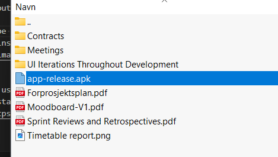

# ShelfAware

## Required packages
Flutter extension (with dart packages) needs to be installed to be able to run any dart code.

Required packages are gathered by running flutter pub get. however, due to the backend and authentication setup, it is not possible for anyone but the development team on this project to run the app functionally through the main method.

## APK
Therefore, for testing of the application, please use the provided apk named app-release.apk, which runs the latest release build for android, and allows for testing the app in its entirety.
In order to get it on a device, connect phone via usb cable and choose option to allow file transfer. Copy over the app-release.apk, then on your phone click on the apk in the folder you transfered it to, and press install. May need to give permission and allow to install without scan.

The APK can be found in this github repository, or within the appendix zip folder uploaded to inspera.

### no IPA
There is no IPA for iPhone, as it requires the developer fee to be paid to have a signed version that works on physical devices.

This project used a starting point by Flutter, see:
[simple app state management
tutorial](https://flutter.dev/to/state-management-sample).

## Assets

The `assets` directory houses images, fonts.

The `assets/images` directory contains [resolution-aware
images](https://flutter.dev/to/resolution-aware-images).

## Localization

This project generates localized messages based on arb files found in
the `lib/src/localization` directory.

To support additional languages, please visit the tutorial on
[Internationalizing Flutter apps](https://flutter.dev/to/internationalization).
